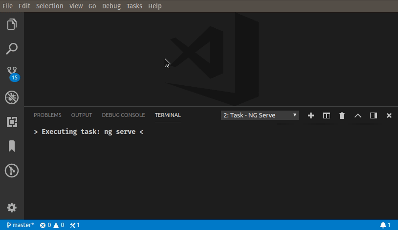

# VSCode sass-loader problem matcher

## Description
This extension provides a sass-loader problem matcher.



## Example
```
// tasks.json entry
{
    "type": "npm",
    "script": "watch",
    "problemMatcher": [
        "$sass-loader"
    ]
}
```

If you plan to use this extension for Angular CLI development, why don't take a look at [Angular CLI Task Provider](https://marketplace.visualstudio.com/items?itemName=genuitec.angular-cli-task-provider).


## License
MIT